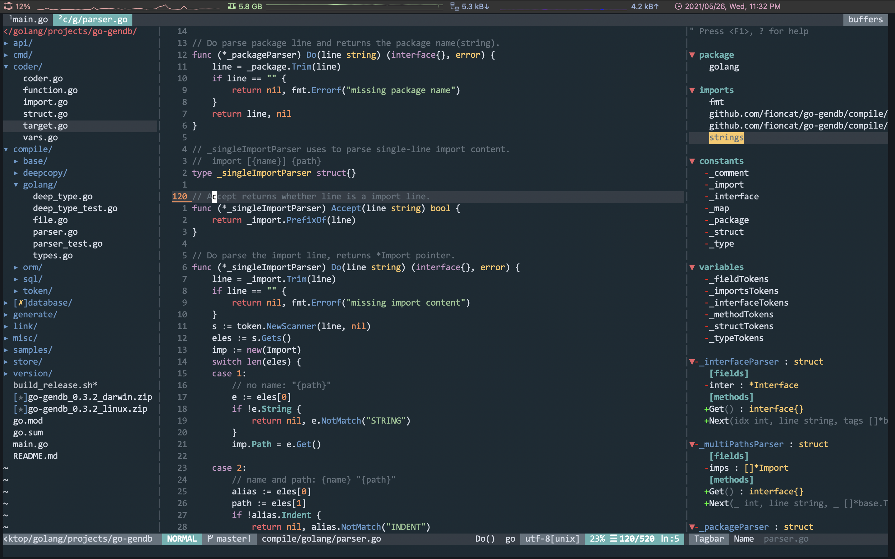
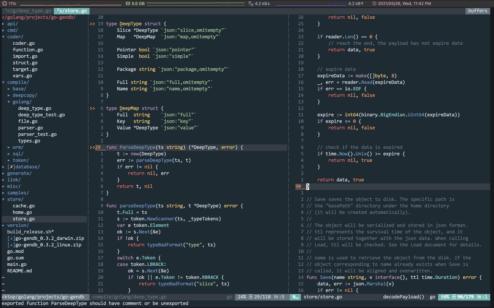

# vim日记

作为一名Golang开发者，使用过各种编辑器/IDE，其中包括：

- GoLand：啥也不说了，做过Java的应该对jetbrains的IDE有深深的情感。GoLand有JetBrains家IDE的所有特色，它不使用gopls而是用自己的language server，因此很快速，并且有着一套异常强大的工具集，调试代码非常方便。唯一的问题就是它不是免费的。
- VsCode：目前最好用的开源编辑器之一，近几年有赶超SublimeText的趋势。插件库异常庞大，可以用无数插件堆砌成一个IDE，目前我同事最多的选择。缺点就是在使用大项目并且插件较多时会比较卡。
- Emacs：老牌编辑器。因为不习惯Emcas-mode，所以我用的是Spacemacs的vim-mode。是我在用vim之前用的最多的编辑器。

比起传统的编辑模式，vim-mode的编辑和文本处理效率是要高上不少的，因此上面的所有编辑器我无一例外都会使用vim插件。但是比起GoLand和VsCode，我还是喜欢纯Vim，Emcas这样的终端编辑器，因为它们可以让我随时快速地编辑文件和输入命令，并且可以在诸如服务器的无GUI环境运行。

其中，我很喜欢Spacemacs的快捷键模式，使用空格(SPC)作为leader键，快捷键采用容易记忆的简写方式配置，例如查看Git Blame使用SPC g b快捷键。我将这种快捷键配置习惯加到了vim中。

我放弃Spacemacs的原因是，它的加载速度太慢了，每次启动需要加载200多个layers，并且我不是很习惯Emacs-Lisp，相比于它，我认为vim-script要人性化太多。

因此我最终选择了纯vim作为我的生产工具，并且事实证明，它的效果是不错的。下面是最终效果图：





自从vim8引入autoload之后，vim的速度还是很不错的。至少我认为目前用纯vim8的体验还是很好的，所以没有去用Neovim。

## 主题

我使用的是[OceanicNext](https://github.com/mhartington/oceanic-next)这个主题，在上面做了一些魔改。因为原主题的GitDiff上不好看，并且没有ALE高亮的相关设置。

魔改的主题在[oceanicnext.vim](oceanicnext.vim)下，将这个文件复制到`~/.vim/colors`下。

然后在`.vimrc`中加入：

```vim-script
" 设置主题
colorscheme oceanicnext
set background=dark
" 适用于gvim
set termguicolors
```

## 基础配置

以下是一些基本的配置。

```vim-script
" 关闭兼容模式
set nocompatible

" 相对行号
set number relativenumber

" 编码为utf-8
set encoding=UTF-8

" 突出显示当前聚焦行
set cursorline

" 高亮显示搜索匹配内容
set showmatch

" 制表符占用4个space
set ts=4
" 自动缩进占用4个space
set shiftwidth=4
" 开启自动缩进
set autoindent

" 实时搜索，搜索时输入字符直接进行匹配，而不必等按下Enter再
" 进行搜索
set incsearch
" 搜索忽略大小写
set ignorecase

" 分屏时，默认在右侧
set splitright

" 不允许生成.swp临时文件，这些文件用于vim异常退出时恢复
" 上一次的更改。如果有这个需求可以去除
set noswapfile

" 启动语法高亮
syntax enable
syntax on

" 在插入模式下，让退格符能删除上一个字符，就像一般的编辑器那样
set backspace=indent,eol,start

" 输入Ctrl-A可以跳转到当前行的第一个非空字符上
" 就像Emacs那样，可以快速回到当前行首
nnoremap <C-a> ^
vmap <C-a> ^

" 很多时候在执行:w的时候会误输入为:W。因此将:W映射为:w
cnoreabbrev W w
" :help默认在右侧vsplite打开帮助文档，方便查看
cnoremap help vert help
```

## vim-plug安装

[vim-plug](https://github.com/junegunn/vim-plug)是一个高效的vim插件管理器。很多人喜欢Vundle，但是vim-plug更加高效，并且它利用了vim8的autoload，能实现异步加载插件，大大提高了vim的启动速度。

使用以下命令安装：

```text
curl -fLo ~/.vim/autoload/plug.vim --create-dirs \
    https://raw.githubusercontent.com/junegunn/vim-plug/master/plug.vim
```

在Linux下，DNS可能遭到污染，导致`raw.githubusercontent.com`这个域名访问不了。可以直接将文件复制下来放到`~/.vim/autoload/plug.vim`即可。